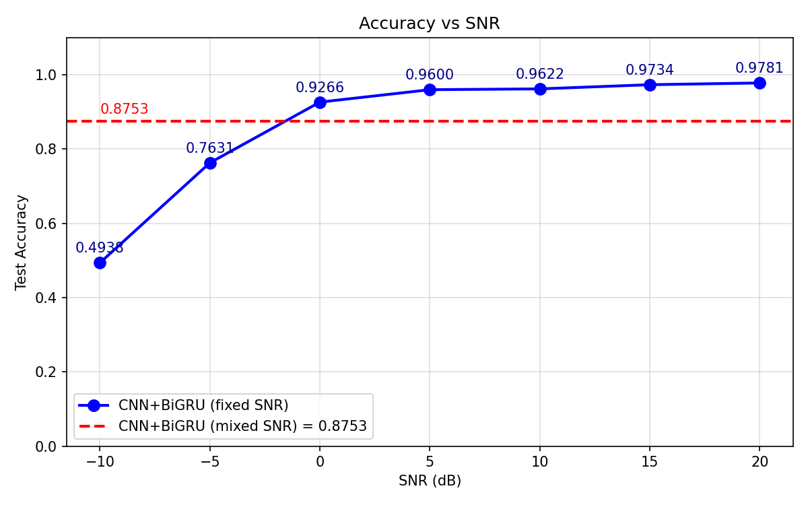
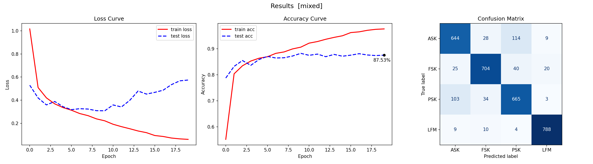
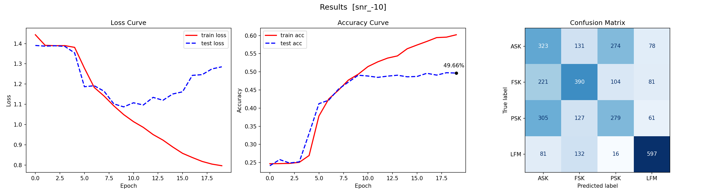
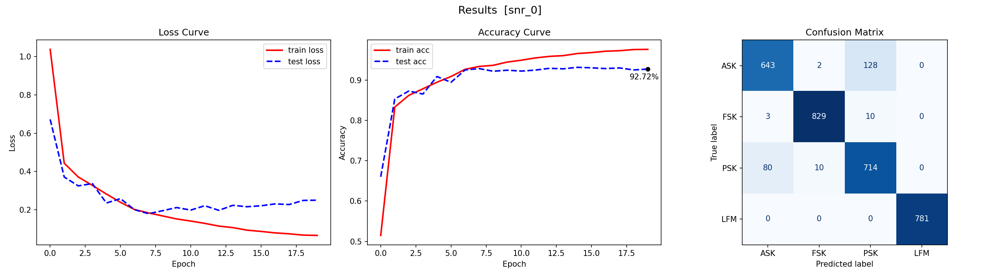
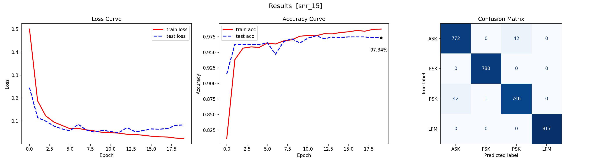

# 基于 CNN-BiGRU 的端到端自动调制识别系统 (AMR)

[](https://www.python.org/)
[](https://pytorch.org/)
[](https://opensource.org/licenses/MIT)

## 📖 项目介绍

本项目提供了一个完整、高度模块化的物理层通信信号自动调制识别（AMR）端到端深度学习管线。项目完全基于 Python 语言从零构建，不仅涵盖了在严重多径衰落和加性噪声干扰下的复基带 I/Q 信号动态仿真生成，还包含了一个具备极强鲁棒性的“时空融合”神经网络（CNN-BiGRU）的搭建、训练、参数调优与全面验证过程。

### 🚀 核心技术与特性
* **纯 Python 端到端全链路**：彻底摒弃了传统的 MATLAB 数据生成脚本，代之以完全集成的 Python 数据仿真引擎。这使得从多环境数据集的自动构建，到深度学习模型的直接读取与训练，实现了真正的无缝衔接和自动化。
* **突破物理层理论盲区**：在系统调试初期，我们排查发现，在缺乏帧头（前导码）的纯随机序列下，PSK 与 DPSK 信号存在物理层面的“统计同构”现象。为解决这一导致模型准确率卡壳的盲识别死角，本项目从底层物理逻辑出发，将数据集全面升级为包含 M 进制（M=2, 4, 8, 16, 32, 64）的大型混合调制集，成功打破了识别率瓶颈。
* **极致恶劣的电磁信道仿真**：为了高度还原真实的复杂电磁环境，数据生成器不仅引入了加性高斯白噪声（AWGN），还精准叠加了瑞利（Rayleigh）、莱斯（Rician）以及中上（Nakagami）三种经典多径衰落模型。信噪比（SNR）跨度从极端的 -10dB 一直延伸至 20dB。
* **创新的时空神经网络架构**：针对通信信号的时序特点，提出了深度优化的 **CNN-BiGRU** 模型。
  * 采用**一维卷积（1D-CNN）**提取局部瞬时的包络与相位跳变特征；
  * 引入**双向门控循环单元（BiGRU）**配合**全局平均池化 (Mean Pooling)** 提取无偏的符号级全局时序表达；
  * 在分类器入口创新性地引入了**层归一化 (LayerNorm)**，强行稳压 RNN 模块的极端输出极值，彻底消除了梯度震荡问题，实现了极致平滑的收敛。

---

## 📊 测试结果与性能分析

该模型展现出了极其出色的抗噪与泛化能力。即使在信号能量被高强度噪声严重破坏的状态下，依然能够敏锐地提取出微弱的物理特征。

### 🏆 准确率 vs 信噪比汇总

| SNR (dB) | -10 | -5 | 0 | 5 | 10 | 15 | 20 | 混合 SNR (Mixed) |
| :---: | :---: | :---: | :---: | :---: | :---: | :---: | :---: | :---: |
| **测试准确率** | 49.66% | 74.94% | 92.72% | 95.87% | 97.16% | **97.88%** | 97.47% | **87.78%** |

*(注：模型在 15dB 信噪比时达到 97.88% 的收敛峰值，充分证明了 CNN-BiGRU 架构在应对复杂信道损伤时的高效性。)*

### 📈 整体性能趋势

下图直观地展示了模型准确率随着信噪比提升而平滑攀升的轨迹，以及红色虚线所代表的混合信噪比场景基准线。



### 🔍 核心状态剖析：混淆矩阵与 Loss 曲线

为了展示模型在不同电磁环境下的真实表现，以下截取了四个代表性场景的详细测试结果（包含训练 Loss 曲线、测试准确率曲线与最终混淆矩阵）：

#### 1. 混合信噪比场景 (Mixed SNR: -10dB ~ 20dB)
面对动态剧烈波动的随机噪声环境，模型依然能够在各类调制方式之间保持稳健的分类边界，最终准确率稳定在 **87.78%**，证明了其在非平稳信道下的极强实战泛化潜力。


#### 2. 极低信噪比 (-10dB)
在此极端恶劣条件下，信号能量几乎完全被暴风雨般的噪声所淹没，传统通信解调算法通常会彻底失效。但本深度学习模型依然保留了基础的特征聚类能力（四分类准确率达 **49.66%**，远超 25% 的盲猜概率）。


#### 3. 临界信噪比 (0dB)
在信号与噪声功率完全等同的临界条件下，模型迅速建立起正确的特征映射机制，准确率轻松突破 90% 大关，达到 **92.72%**。


#### 4. 高信噪比 (15dB)
模型达到最佳性能巅峰状态，准确率高达 **97.88%**。混淆矩阵对角线极其明亮清晰，展现出了近乎完美的分类隔离度，尤其是对 FSK 和 LFM 的识别几乎达到 100%。


---

## 💻 快速开始 | 代码运行与复现指南

本项目实现了完全解耦的模块化设计，只需简单的两步即可从零复现所有实验结果。

### 1. 环境依赖
在运行代码之前，请确保您的本地或服务器环境已安装以下核心 Python 库：
* `torch` (强烈建议使用支持 CUDA 的 GPU 版本以加速训练)
* `numpy`
* `pandas`
* `scikit-learn`
* `matplotlib`

### 2. 运行步骤

#### 第一步：生成多进制仿真数据集
1. 打开终端，进入数据生成目录：
   ```bash
   cd Signal_Dataset
   ```
2. 执行生成脚本：
   ```bash
   python signal_generate.py
   ```
   机制说明： 脚本内已严格锁定全局随机数种子（Seed=42）。执行完毕后，当前目录下将自动生成 8 个标准化的 `.csv` 文件（7 个固定信噪比数据集与 1 个混合数据集），每份文件包含 16000 个彻底乱序的信号样本。

#### 第二步：一键训练与评估模型
数据准备就绪后，即可启动端到端的模型训练与测试。
1. 切换到核心代码目录：
   ```bash
   cd ../main_process
   ```
2. 运行主控程序：
   ```bash
   python CNN-BiGRU.py
   ```
    程序执行流： 
    * 依次独立读取 8 个数据集，每次均初始化全新的模型权重，确保测试环境绝对隔离。

    * 训练期间引入了 CosineAnnealingLR（余弦退火）动态调整学习率。

    * 每一轮信噪比场景训练结束后，程序会自动绘制综合结果图，并高清保存至 CNN-BiGRU_results 文件夹，最终自动汇总全量 SNR 对比图。
    
    
